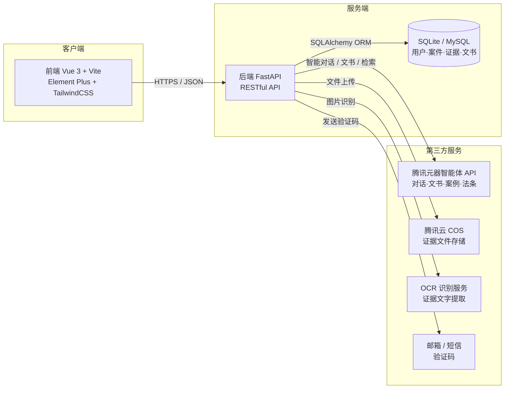
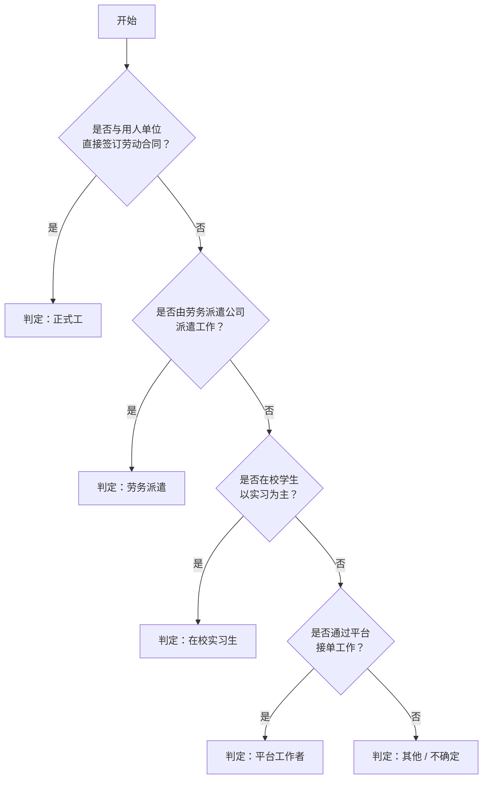
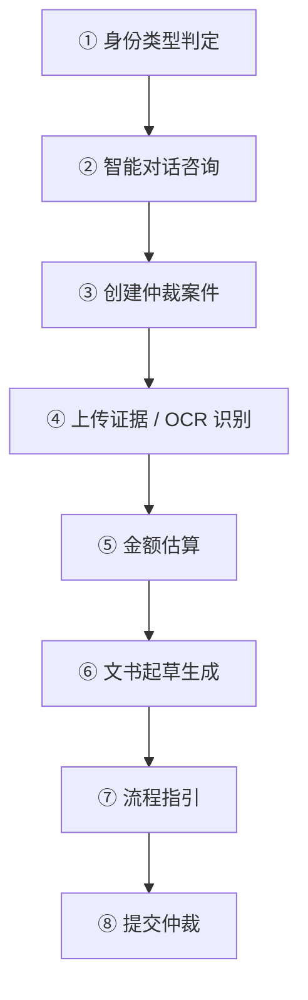

# 劳动仲裁智能辅助系统

> 面向普通劳动者的一站式劳动仲裁维权辅助平台。用 AI 降低维权门槛，覆盖「身份判定 → 智能咨询 → 证据准备 → 金额估算 → 文书生成 → 流程指引」全流程。

[](https://www.python.org)
[](https://fastapi.tiangolo.com)
[](https://vuejs.org)
[](https://vitejs.dev)

---

## 📑 目录

- [项目简介](#项目简介)
- [✨ 核心功能](#核心功能)
- [🏗️ 系统架构](#系统架构)
- [🛠️ 技术栈](#技术栈)
- [👥 劳动者类型与场景](#劳动者类型与场景)
- [📁 项目结构](#项目结构)
- [📦 环境要求](#环境要求)
- [🚀 安装与配置](#安装与配置)
- [💡 使用指南](#使用指南)
- [🔌 API 概览](#api-概览)
- [🔐 安全说明](#安全说明)
- [❓ 常见问题](#常见问题)
- [📄 许可证](#许可证)

---

## 项目简介

劳动争议仲裁是劳动者维权的重要途径，但普通劳动者在仲裁过程中面临诸多困难：不清楚自己属于哪类劳动者、不知道需要哪些证据、不会撰写规范的仲裁申请书、算不清应得的赔偿金额。

本系统通过智能化手段提供一站式辅助服务：交互式问答判定劳动者类型，AI 智能对话解答法律问题，按类型与场景推送证据清单，自动估算赔偿金额，并基于证据材料生成规范的仲裁申请书，最后给出针对性仲裁流程指引。

---

## 核心功能

| 功能模块 | 说明 | 关键能力 |
|---------|------|---------|
| 🧭 身份类型判定 | 交互式问答判定劳动者类型 | 5 步问卷，覆盖正式工 / 劳务派遣 / 实习生 / 平台工 |
| 💬 智能对话咨询 | 自然语言法律问题咨询 | 按类型与场景返回「问题复述→法律依据→解读分析→建议操作」 |
| 📂 案件管理 | 多案件并行管理 | 创建 / 查看 / 删除，进展阶段追踪（创建→证据→文书→完成） |
| 🖼️ 证据管理 | 证据上传与 OCR 识别 | 劳动合同 / 工资流水 / 社保 / 考勤等，一键发送至文书 |
| 📝 文书起草 | AI 生成仲裁申请书 | 图片 / 文档智能分析 → 结构化证据摘要 → 规范文书 |
| 🧮 金额估算 | 多场景赔偿计算 | 经济补偿金 / 加班费 / 欠薪 / 罚款上限核对，含计算过程 |
| 🗺️ 流程指引 | 针对性仲裁流程 | 管辖仲裁委、标准步骤、材料清单、地图检索 |

---

## 系统架构



---

## 技术栈

| 层级 | 技术 | 说明 |
|------|------|------|
| 前端框架 | Vue 3 + Vite | 组件化、响应式、支持多端适配 |
| UI 组件 | Element Plus + TailwindCSS | 企业级组件库 + 原子化样式 |
| 状态管理 | Pinia | 全局用户态与案件态 |
| 后端框架 | FastAPI (Python) | 异步高并发、自动生成 OpenAPI 文档 |
| 数据校验 | Pydantic | 请求 / 响应模型校验 |
| 数据库 | SQLAlchemy + SQLite | 开发用 SQLite，生产可切换 MySQL |
| 认证 | JWT + bcrypt | 7 天有效期 Token，密码加密存储 |
| AI 服务 | 腾讯元器智能体 API | 多智能体协同（咨询 / 文书 / 案例 / 法条） |
| 文件存储 | 腾讯云 COS | 证据图片与文档云端存储 |
| 文字识别 | OCR 服务 | 证据图片关键信息提取 |

---

## 劳动者类型与场景

系统针对五类劳动者提供差异化服务，每类对应多个细分纠纷场景：

| 类型 | 标识 | 典型场景 |
|------|------|---------|
| 正式工 | `employee` | 违法解除、未签合同双倍工资、加班费、年休假工资 |
| 劳务派遣 | `dispatch` | 同工同酬、社保责任划分、派遣合同纠纷 |
| 在校实习 | `intern` | 实习报酬拖欠、协议违约、实习证明纠纷 |
| 平台工作 | `platform` | 骑手 / 网约车加班争议、订单罚款、劳动关系认定 |
| 其他 / 不确定 | `other_uncertain` | 引导用户完成类型判定 |

**身份判定流程（5 步问卷）：**



---

## 项目结构

```
劳动仲裁智能辅助系统/
├── backend/                      # 后端（FastAPI）
│   ├── app/
│   │   ├── routers/              # API 路由（auth/labor/cases/evidence/document/agent/calc/law/case_search）
│   │   ├── models/               # SQLAlchemy 数据模型
│   │   ├── services/             # 业务逻辑（AI 服务、文档工作流等）
│   │   ├── schemas/              # Pydantic 数据校验模型
│   │   ├── data/                 # 静态数据（场景目录、高频问题等）
│   │   ├── deps.py               # 依赖注入（认证、数据库会话）
│   │   └── main.py               # 应用入口
│   ├── database.py               # 数据库配置
│   ├── requirements.txt          # Python 依赖
│   ├── .env.example              # 环境变量模板（提交到仓库）
│   └── .env                      # 本地真实配置（不提交，已被 gitignore）
│
├── frontend/                     # 前端（Vue 3 + Vite）
│   ├── src/
│   │   ├── views/                # 页面组件（首页、案件、对话、文书等）
│   │   ├── components/           # 公共组件（身份选择弹窗等）
│   │   ├── stores/               # Pinia 状态管理
│   │   ├── api/                  # HTTP 请求封装
│   │   ├── router/               # Vue Router 配置
│   │   └── App.vue               # 根组件
│   ├── index.html
│   ├── package.json
│   └── vite.config.js
│
├── 项目说明文档.md                # 详细产品说明
├── 环境安装及运行手册.md           # 安装与启动手册
└── README.md                     # 本文件
```

---

## 环境要求

| 依赖 | 版本要求 |
|------|---------|
| Python | 3.10 及以上 |
| Node.js | 18.x 及以上 |
| npm | 9.x 及以上（推荐 pnpm） |
| 操作系统 | Windows 10/11、macOS、Linux |

---

## 安装与配置

> ⚠️ 以下步骤默认使用国内镜像以加速依赖安装。

### 1. 克隆仓库

```bash
git clone git@github.com:2066513819/Labour-arbitration-help.git
cd Labour-arbitration-help
```

### 2. 后端

```bash
cd backend

# 创建并激活虚拟环境
python -m venv venv
# Windows:
.\venv\Scripts\Activate
# macOS / Linux:
source venv/bin/activate

# 安装依赖
pip install -r requirements.txt -i https://pypi.tuna.tsinghua.edu.cn/simple

# 配置环境变量
cp .env.example .env
# 编辑 .env，填入真实 API Key / COS / 邮箱等（详见下方说明）

# 初始化并启动
python main.py            # 自动创建 SQLite 数据库
# 或开发模式热重载：
uvicorn app.main:app --reload --port 8000
```

启动后访问后端 API 文档：**http://localhost:8000/docs**

**关键环境变量（`.env`）：**

| 变量 | 说明 |
|------|------|
| `DATABASE_URL` | 数据库连接串，开发默认 `sqlite:///./labor_arb.db` |
| `SECRET_KEY` | JWT 密钥，生产环境务必改为强随机值 |
| `YUANQI_API_KEY` / `YUANQI_AGENT_ID` | 腾讯元器智能体（智能对话）凭证 |
| `DOCUMENT_AGENT_API_KEY` / `DOCUMENT_AGENT_ID` | 文书起草智能体凭证 |
| `WORKFLOW_API_KEY` / `WORKFLOW_AGENT_ID` | 文书工作流凭证 |
| `EMAIL_SMTP_*` | 邮箱验证码 SMTP 配置（推荐，零资质门槛） |
| `COS_SECRET_ID` / `COS_SECRET_KEY` / `COS_BUCKET` | 腾讯云 COS 文件存储 |

> 若暂时没有 AI / COS 凭证，系统仍可启动并运行除 AI 对话、文书、文件上传外的功能（含本地规则兜底）。

### 3. 前端

```bash
cd frontend

# 安装依赖（使用国内镜像）
npm install --registry=https://registry.npmmirror.com
# 或 pnpm install

# 启动开发服务器
npm run dev

# 构建生产版本（产物在 dist/）
npm run build
```

前端地址：**http://localhost:5173**

---

## 使用指南

标准维权流程如下图所示，系统在每个环节都提供智能辅助：



**典型场景示例（张先生被违法辞退）：**

1. **类型判定**：回答几个问题，系统判定为「正式工」。
2. **智能咨询**：描述被辞退经过，AI 建议主张 2N 违法解除赔偿金并列出所需证据。
3. **创建案件**：在「我的案件」中新建案件「公司违法辞退赔偿」。
4. **上传证据**：上传劳动合同、工资流水、解除通知，系统 OCR 提取关键日期与金额。
5. **金额估算**：输入入职 / 离职日期与月薪，系统计算违法解除赔偿金。
6. **生成文书**：系统加载案件证据，AI 生成仲裁申请书草稿，在线修改确认后保存。
7. **流程指引**：查看所需材料清单，获取管辖仲裁委地址，准备提交。

---

## API 概览

所有接口均以 `/api` 为前缀，除登录 / 发送验证码外均需 `Authorization: Bearer <token>` 头。

| 模块 | 方法 | 路径 | 说明 |
|------|------|------|------|
| 认证 | POST | `/api/auth/send-code` | 发送短信验证码 |
| 认证 | POST | `/api/auth/sms-login` | 短信验证码登录，返回 JWT |
| 认证 | POST | `/api/auth/send-email-code` | 发送邮箱验证码 |
| 认证 | POST | `/api/auth/email-login` | 邮箱验证码登录，返回 JWT |
| 认证 | GET | `/api/auth/me` | 获取当前用户信息 |
| 认证 | PUT | `/api/auth/me/laborer-type` | 更新劳动者类型 |
| 劳动知识 | GET | `/api/labor/types` | 劳动者类型列表 |
| 劳动知识 | GET | `/api/labor/scenarios` | 场景目录 |
| 劳动知识 | GET | `/api/labor/classification-flow` | 类型判定问卷 |
| 劳动知识 | POST | `/api/labor/classification-result` | 提交判定结果 |
| 劳动知识 | GET | `/api/labor/faq` | 高频问题 |
| 劳动知识 | GET | `/api/labor/guide` | 流程指引 |
| 劳动知识 | GET | `/api/labor/evidence-checklist` | 证据清单 |
| 案件 | GET | `/api/cases` | 案件列表 |
| 案件 | POST | `/api/cases` | 创建案件 |
| 案件 | GET | `/api/cases/{case_id}` | 案件详情 |
| 案件 | DELETE | `/api/cases/{case_id}` | 删除案件 |
| 证据 | POST | `/api/evidence/upload` | 上传证据文件 |
| 证据 | POST | `/api/evidence/upload/base64` | base64 上传 |
| 证据 | GET | `/api/evidence/list/{case_id}` | 案件证据列表 |
| 证据 | DELETE | `/api/evidence/{evidence_id}` | 删除证据 |
| 文书 | POST | `/api/document/generate/{case_id}` | 生成仲裁申请书 |
| 文书 | POST | `/api/document/upload-image` | 上传图片待分析 |
| 文书 | POST | `/api/document/analyze-image` | 分析图片提取信息 |
| 文书 | POST | `/api/document/chat` | 文书起草对话 |
| 文书 | POST | `/api/document/generate-from-chat` | 从对话生成文书 |
| 智能体 | POST | `/api/agent/ask` | 智能对话咨询 |
| 智能体 | GET | `/api/agent/history` | 对话历史 |
| 智能体 | POST | `/api/agent/sidebar-chat` | 侧边栏知识问答 |
| 计算 | POST | `/api/calc/estimate` | 金额估算 |
| 法条 | POST | `/api/law/search` | 法条检索 |
| 法条 | GET | `/api/law/quick-categories` | 法条快捷分类 |
| 案例 | POST | `/api/case-search/search` | 案例检索 |
| 案例 | GET | `/api/case-search/quick-types` | 案例快捷类型 |

---

## 安全说明

- 🔒 **切勿提交真实密钥**：`backend/.env` 已被 `.gitignore` 忽略，仓库中仅保留 `.env.example` 占位模板。请勿手动 `git add .env`。
- 🔑 **生产环境**务必将 `SECRET_KEY` 替换为强随机值（生成：`python -c "import secrets; print(secrets.token_hex(32))"`）。
- 🧱 **密码安全**：用户密码使用 bcrypt 加密存储；JWT Token 有效期 7 天。
- 🚧 **数据隔离**：每个用户仅能访问自己的案件 / 证据 / 文书数据，后端强制校验所有权。
- 🛡️ **防护**：SQL 注入（ORM 参数化）、XSS（前端转义）、文件上传大小与类型限制、验证码发送频率限制。

---

## 常见问题

**Q1：后端启动报 `ModuleNotFoundError`？**
确保已激活虚拟环境并执行 `pip install -r requirements.txt`。

**Q2：前端无法连接后端？**
检查后端是否运行在 `http://localhost:8000`，并确认 `vite.config.js` 中的代理配置指向该地址。

**Q3：依赖安装缓慢或失败？**
Python 用清华镜像：`pip install -r requirements.txt -i https://pypi.tuna.tsinghua.edu.cn/simple`；
Node 用 npmmirror：`npm install --registry=https://registry.npmmirror.com`。

**Q4：数据库异常？**
删除 `backend/labor_arb.db`，重启后端会自动重建。

**Q5：元器 API 调用失败？**
检查 `.env` 中 `YUANQI_API_KEY` 与 `YUANQI_AGENT_ID` 是否正确，以及网络是否可访问腾讯元器服务。

---

## 许可证

本项目以 MIT 许可证开源，详见 [LICENSE](LICENSE)。

> 文档版本：1.0 · 更新时间：2026 年 9 月
